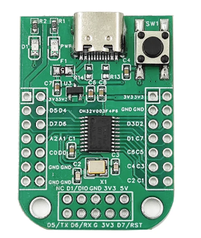

# ch32v003_Arduino
Really basic attempt to replicate Arduino functions inside MounRiver 

Unfortunately ch32v003 is C so class is not possible so it won't really arduino compatible.

# Dev Board used:
## [Aliexpress Link](https://fr.aliexpress.com/item/1005004964355080.html)   

## Photo

## You need the programmer, the USB is just for power!

## Pinout
* Builtin led: D4
* Builtin button (pull-up) : D7

# Getting Started

* [Download MounRiver Studio](http://www.mounriver.com/download)
* File/Load **template/ArduinoTemplate.wvproj**
* Examples are availables in **examples/** just copy main.c in template

# Functions availables

# Sources
* Based on BitBank2 Expirements
https://github.com/bitbank2/CH32V_Experiments

* Green Dragon Maker Space WS2812b source
https://radicalbakers.org/ch32v003/
